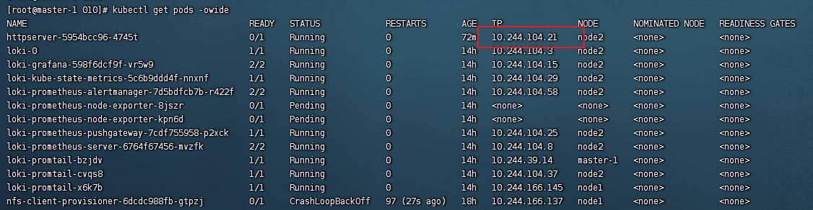
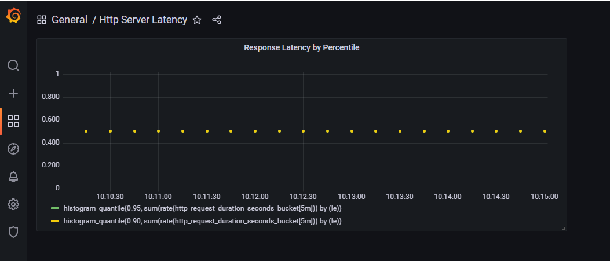

1. 为 HTTPServer 添加 0-2 秒的随机延时；
2. 为 HTTPServer 项目添加延时 Metric；
3. 将 HTTPServer 部署至测试集群，并完成 Prometheus 配置；
4. 从 Promethus 界面中查询延时指标数据；
5. （可选）创建一个 Grafana Dashboard 展现延时分配情况。

### 程序增加metrics逻辑

```yaml
var requestDurations = prometheus.NewHistogram(prometheus.HistogramOpts{
    Name:    "http_request_duration_seconds",
    Help:    "A histogram of the HTTP request durations in seconds.",
    Buckets: prometheus.ExponentialBuckets(0.1, 1.5, 5),
})

# 增加init
func init() {
	prometheus.Register(requestDurations)
}

# 定义统一的拦截器 
func prometheusMiddleware(next http.Handler) http.Handler {
	return http.HandlerFunc(func(w http.ResponseWriter, r *http.Request) {
        now := time.Now()

		next.ServeHTTP(w, r)

        requestDurations.(prometheus.ExemplarObserver).ObserveWithExemplar(
            time.Since(now).Seconds(), prometheus.Labels{"api": "healthz"},
        )
	})
}

# 暴露监控端点
// Prometheus endpoint
router.Path("/metrics").Handler(promhttp.Handler())
```

### 修改部署 yaml文件

```yaml
# annotations 添加如下信息
template:
    metadata:
      annotations:
        prometheus.io/scrape: "true"
        prometheus.io/port: "19004"
```

测试POD



```yaml
# 访问pod的ip 查看prometheus指标信息

[root@master-1 010]# curl 10.244.104.21:19004/metrics
# HELP go_gc_duration_seconds A summary of the pause duration of garbage collection cycles.
# TYPE go_gc_duration_seconds summary
go_gc_duration_seconds{quantile="0"} 4.5556e-05
go_gc_duration_seconds{quantile="0.25"} 0.000162273
go_gc_duration_seconds{quantile="0.5"} 0.000220201
go_gc_duration_seconds{quantile="0.75"} 0.000355467
go_gc_duration_seconds{quantile="1"} 0.000736432
go_gc_duration_seconds_sum 0.007338236
go_gc_duration_seconds_count 27
# HELP go_goroutines Number of goroutines that currently exist.
# TYPE go_goroutines gauge
go_goroutines 9
# HELP go_info Information about the Go environment.
```

### 安装 loki stack

```bash
# 安装 loki stack
# k8s 域名下的镜像拉取不下来的情况 使用 ./pull-k8s-image.sh  k8s.gcr.io/kube-state-metrics/kube-state-metrics:v2.3.0 
helm upgrade --install loki grafana/loki-stack --set "grafana.enabled=true, prometheus.enable=true, prometheus.alertmanager.persistentVolume.enabled=false, prometheus.server.persistentVolume.enabled=false"

#  修改服务中的内部集群IP 为NODEIP 方便外部访问测试
kubectl edit svc loki-grafana -oyaml -n default

# 替换ClusterIP 为 NodePort
type: NodePort
```

### 查看 grafana的访问信息

```yaml
# 查看grafana的登录密码
[root@master-1 010]# kubectl get secret loki-grafana -oyaml -n default
apiVersion: v1
data:
  admin-password: alZ5cHhJaEVEY3VCbVVFM1NzNFpvcnlFc2tSeWFzdURwZzZhOTE0Qg==
  admin-user: YWRtaW4=
  ldap-toml: ""
kind: Secret
metadata:
  annotations:
    meta.helm.sh/release-name: loki
    meta.helm.sh/release-namespace: default
  creationTimestamp: "2022-12-07T11:50:58Z"
  labels:
    app.kubernetes.io/instance: loki
    app.kubernetes.io/managed-by: Helm
    app.kubernetes.io/name: grafana
    app.kubernetes.io/version: 8.3.5
    helm.sh/chart: grafana-6.43.5
  name: loki-grafana
  namespace: default
  resourceVersion: "18727948"
  uid: be872436-20ce-4707-9d37-eba4d32a46af
type: Opaque

#对admin-password 进行base64 获取密码]
echo 'alZ5cHhJaEVEY3VCbVVFM1NzNFpvcnlFc2tSeWFzdURwZzZhOTE0Qg==' | base64 -d

--》   jVypxIhEDcuBmUE3Ss4ZoryEskRyasuDpg6a914B

[root@master-1 010]# kubectl get  service
NAME                            TYPE        CLUSTER-IP      EXTERNAL-IP   PORT(S)        AGE
httpsvc                         ClusterIP   10.96.100.38    <none>        80/TCP         41h
kubernetes                      ClusterIP   10.96.0.1       <none>        443/TCP        81d
loki                            ClusterIP   10.96.227.142   <none>        3100/TCP       14h
loki-grafana                    NodePort    10.96.216.149   <none>        80:30151/TCP   14h
loki-headless                   ClusterIP   None            <none>        3100/TCP       14h
loki-kube-state-metrics         ClusterIP   10.96.137.188   <none>        8080/TCP       14h
loki-memberlist                 ClusterIP   None            <none>        7946/TCP       14h
loki-prometheus-alertmanager    ClusterIP   10.96.206.211   <none>        80/TCP         14h
loki-prometheus-node-exporter   ClusterIP   None            <none>        9100/TCP       14h
loki-prometheus-pushgateway     ClusterIP   10.96.14.122    <none>        9091/TCP       14h
loki-prometheus-server          ClusterIP   10.96.218.178   <none>        80/TCP         14h

使用 NODEIP：30151  访问  grafana
```

### 添加 Dashboard 后 查看prometheus收集的指标

