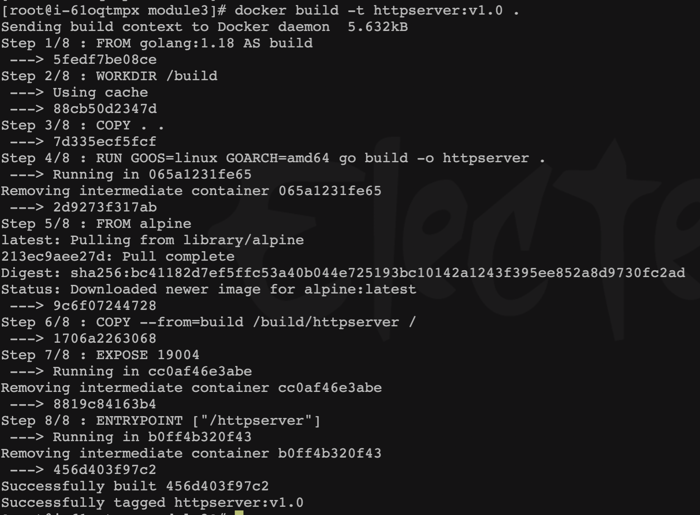
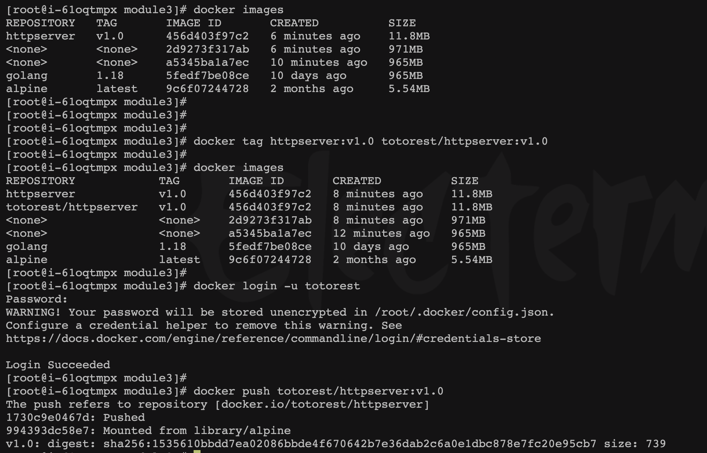
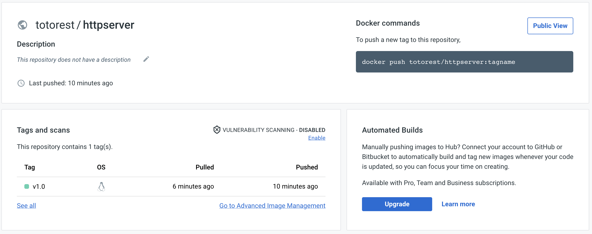
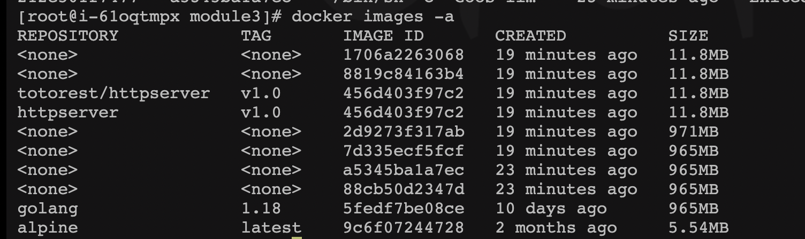
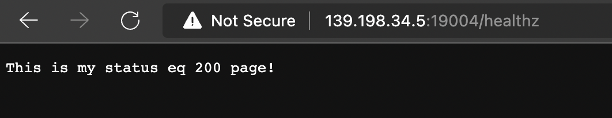
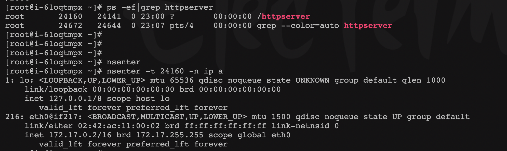

任务

- 构建本地镜像
- 编写 Dockerfile 将模块二作业编写的 httpserver 容器化
- 将镜像推送至 docker 官方镜像仓库
- 通过 docker 命令本地启动 httpserver
- 通过 nsenter 进入容器查看 IP 配置

---

1. 在 httpserver.go 的同级目录创建 Dockerfile 文件
    
    ```docker
    FROM golang:1.18 AS build
    
    ENV GOOS=linux \
        GOARCH=amd64
    
    WORKDIR /build
    COPY . .
    RUN go build -o httpserver
    
    FROM alpine
    COPY --from=build /build/httpserver /
    EXPOSE 19004
    
    ENTRYPOINT ["/httpserver"]
    ```
    
2. 打包 标签 推送镜像
    
    ```docker
    # 本地打包镜像
    docker build -t httpserver:v1.0 .
    
    #本地测试镜像
    docker run --name=httpserver1.0   -d  --restart=always -p  19004:19004   httpserver:v1.0
    
    # 打包远程镜像
    docker tag httpserver:v1.0 totorest/httpserver:v1.0
    
    # 登录远程镜像仓库
    docker login -u totorest
    
    # 推送仓库
    docker push totorest/httpserver:v1.0
    
    # 推送完成镜像后退出
    docker logout
    ```
    
    

    
    
    
    
3. 拉取镜像
    
    ```docker
    # 删除本地镜像
    docker rmi totorest/httpserver:v1.0
    
    # 从云端拉取镜像
    docker pull totorest/httpserver:v1.0
    ```
    
4. 本地启动镜像
    
    ```docker
    docker run --name=httpserver   -d  --restart=always -p  19004:19004   totorest/httpserver:v1.4
    ```
    
    
    

5. 进入容器
    
    ```docker
    ps -ef|grep httpserver
    
    nsenter -t 24160 -n ip a
    ```
    
    